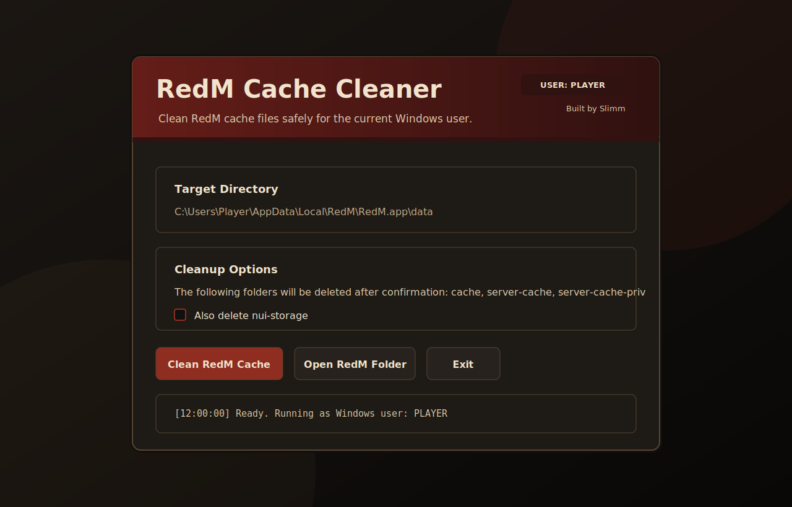
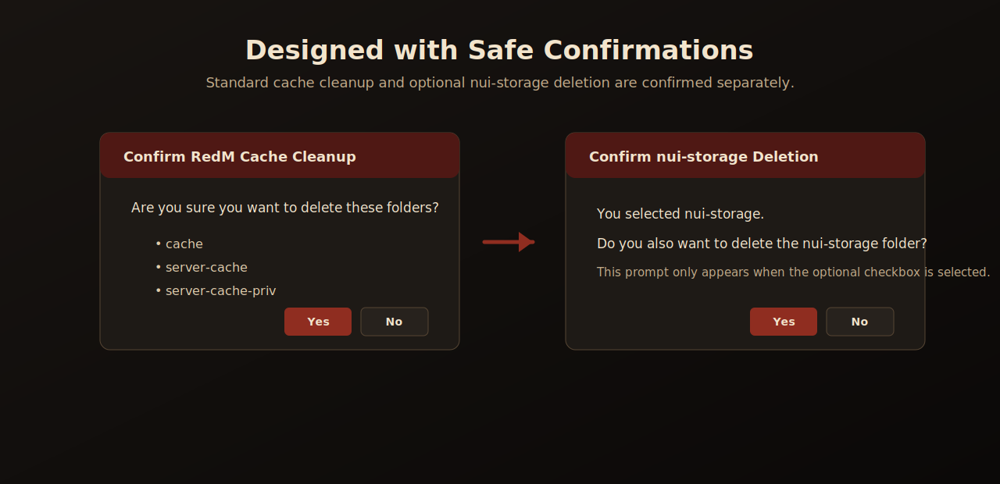

# RedM Cache Cleaner App

<p align="center">
  
</p>

<p align="center">
  <strong>A clean Windows GUI utility for clearing RedM cache folders safely for the current Windows user.</strong>
</p>

<p align="center">
  <a href="https://github.com/sdmactech/RedMCacheCleanern/releases/latest"></a>
  <a href="https://github.com/sdmactech/RedMCacheCleanern/releases/download/v1.0.0/RedM.Cache.Cleaner.App.zip"></a>
  
</p>

---

## Download

Download the latest ZIP from the release page:

**[Download RedM Cache Cleaner App.zip](https://github.com/sdmactech/RedMCacheCleanern/releases/download/v1.0.0/RedM.Cache.Cleaner.App.zip)**

If you want to view all releases, visit the **[Releases page](https://github.com/sdmactech/RedMCacheCleanern/releases)**.

---

## What it does

RedM Cache Cleaner App is a small Windows utility that helps RedM players clear common local cache folders without manually digging through `AppData`. The app automatically targets the Windows user who launches it by using the current user's local app data path.

By default, after confirmation, it can delete:

- `cache`
- `server-cache`
- `server-cache-priv`

It also includes an optional checkbox to delete:

- `nui-storage`

Because `nui-storage` can contain separate UI/browser storage data, the app asks for a **second confirmation** before deleting it.

<p align="center">
  
</p>

---

## How to use

1. Double-click **`RedM Cache Cleaner.vbs`** to launch the app.
2. Review the target RedM data folder shown in the app.
3. Click **Clean RedM Cache**.
4. Confirm the cleanup when prompted.
5. If you selected **Also delete nui-storage**, confirm the second prompt if you still want to delete it.

> Close RedM before cleaning. If RedM is open, Windows may prevent some folders from being deleted.

---

## Included files

| File | Purpose |
| --- | --- |
| `RedM Cache Cleaner.vbs` | Main double-click launcher. Opens the app without leaving a console window visible. |
| `redm_cache_cleaner_w_background_windows.bat` | Fallback launcher. Use this if the VBS launcher does not work on your computer. |
| `support_redm_cleaner_Gps1.ps1` | The PowerShell WinForms GUI app. Keep this in the same folder as the launchers. |
| `support_cleanup_universal.bat` | Universal batch fallback/support script. |
| `README.txt` | Simple offline instructions included with the ZIP. |

---

## Target folder

The app targets this RedM data folder for the current Windows user:

```text
%LOCALAPPDATA%\RedM\RedM.app\data
```

That normally resolves to something like:

```text
C:\Users\YourWindowsUsername\AppData\Local\RedM\RedM.app\data
```

No hardcoded username is required.

---

## Troubleshooting

### The app does not open

Try double-clicking:

```text
redm_cache_cleaner_w_background_windows.bat
```

That launcher may show a console window briefly, but it launches the same app.

### Windows blocks the file

If Windows SmartScreen or antivirus asks about the file, only allow it if you trust where you downloaded it from.

If PowerShell blocks the script, right-click the ZIP before extracting, choose **Properties**, check **Unblock** if available, click **Apply**, then extract the ZIP again.

### RedM folder not found

Make sure RedM has been installed and launched at least once for the current Windows user.

---

## Notes for server communities

This utility is meant to be simple enough to send to players who need a quick RedM cache reset. Share the release ZIP link with users and tell them to extract the ZIP before launching the app.

---

## Credit

Created by Slimm
